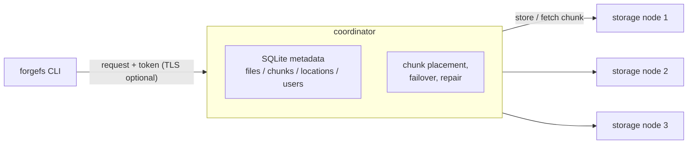

# ForgeFS

A distributed file-storage system in modern C++20. A CLI client uploads files
to a coordinator, which splits them into chunks, replicates each chunk across
storage nodes, verifies integrity with SHA-256, and keeps files available when
a node fails.



## Features

- **Custom binary TCP protocol** with streamed, bounded-memory transfers
- **Chunking and replication:** 4 MiB content-addressed chunks, each stored on
  up to 3 nodes; downloads fail over between replicas and verify every chunk's
  hash, so a corrupted replica is skipped
- **Self-healing:** a background monitor re-replicates chunks that fall below
  the replication factor after a node goes down
- **End-to-end integrity:** SHA-256 verified on upload, download, and via
  `forgefs verify`
- **Concurrency:** thread-pool servers; metadata locking never held across
  network calls
- **Security:** PBKDF2-HMAC-SHA256 password hashing, bearer-token sessions,
  optional TLS between client and coordinator
- **One-command deployment** with Docker Compose
- **Tests and benchmarks:** GoogleTest unit tests, multi-process integration
  tests, and a throughput/latency benchmark tool

## Quickstart (Docker Compose)

```bash
git clone https://github.com/DSmithin/ForgeFS.git
cd ForgeFS
docker compose up --build -d      # coordinator + 3 storage nodes
```

The CLI runs as a one-shot container. Files in `./demo_files` appear at
`/files` inside it:

```bash
docker compose run --rm client login demo          # demo account, see below
docker compose run --rm client nodes
cp ./some_file.txt ./demo_files/
docker compose run --rm client upload /files/some_file.txt
docker compose run --rm client list

docker compose stop storage-2                      # take a replica down
docker compose run --rm client download some_file.txt /files/out.txt
docker compose run --rm client verify some_file.txt

docker compose down -v
```

The compose file provisions a `demo` / `demo-password` account on first boot.
Those credentials are demo-only; don't reuse the pattern for anything real.

## CLI

| Command | Description |
|---|---|
| `login <username>` | Authenticate; caches a session token at `~/.forgefs/token` |
| `upload <path> [name]` | Upload a file |
| `download <name> [path]` | Download and verify a file |
| `list` | List stored files |
| `delete <name>` | Delete a file |
| `verify <name>` | Recompute the stored file's hash and compare it to the recorded one |
| `nodes` | Show storage nodes and health |
| `status` | Cluster summary |

Global flags: `--server host:port` (or `FORGEFS_SERVER`), `--tls [--ca PATH]`.
`FORGEFS_PASSWORD` makes `login` non-interactive.

## Building from source

Requires Linux (the code uses POSIX sockets and process APIs), a C++20
compiler, CMake 3.20+, and OpenSSL and SQLite3 development headers.

```bash
# Debian/Ubuntu
sudo apt-get install -y build-essential cmake libssl-dev libsqlite3-dev
# Fedora
sudo dnf install -y gcc-c++ cmake openssl-devel sqlite-devel

cmake -S . -B build -DCMAKE_BUILD_TYPE=Release
cmake --build build -j
```

This produces `build/server/forgefs_server`, `build/storage/forgefs_storage`,
`build/client/forgefs_client`, and `build/benchmarks/forgefs_benchmark`.
Configure fetches GoogleTest once via `FetchContent`; pass
`-DFORGEFS_BUILD_TESTS=OFF` to skip it.

Running a local cluster:

```bash
./build/server/forgefs_server --data-dir server_data --create-user alice   # once
./build/server/forgefs_server --data-dir server_data

./build/storage/forgefs_storage --port 9101 --data-dir node1 --id node-1 --register 127.0.0.1:9000
./build/storage/forgefs_storage --port 9102 --data-dir node2 --id node-2 --register 127.0.0.1:9000
./build/storage/forgefs_storage --port 9103 --data-dir node3 --id node-3 --register 127.0.0.1:9000

./build/client/forgefs_client login alice
./build/client/forgefs_client upload ./some_file.txt
```

Every server/node flag has a `FORGEFS_*` environment-variable equivalent
(flags win); see `--help`.

### TLS

```bash
openssl req -x509 -newkey rsa:2048 -nodes -days 365 \
    -keyout server.key -out server.crt -subj "/CN=localhost"

./build/server/forgefs_server --data-dir server_data --tls-cert server.crt --tls-key server.key
./build/client/forgefs_client --tls --ca server.crt login alice
```

Without `--ca` the client does not verify the server certificate (fine for a
local self-signed cert, not otherwise). Coordinator-to-storage-node traffic is
not encrypted or authenticated; see [docs/SECURITY.md](docs/SECURITY.md).

## Testing

```bash
ctest --test-dir build --output-on-failure
```

- **Unit tests:** protocol codec, SHA-256 vectors, password hashing, session
  tokens, path validation, and `ChunkStore` metadata logic against real SQLite.
- **Integration tests:** start a real coordinator and three storage nodes as
  subprocesses and drive them over the wire protocol. They cover
  upload/download round-trips, auth rejection, killing a node, a corrupted
  on-disk replica, and malformed input.

## Benchmarks

```bash
./build/benchmarks/forgefs_benchmark sweep --username bench --size 1048576 --count 40 --levels 1,2,4,8,16
```

See [docs/BENCHMARKS.md](docs/BENCHMARKS.md).

## Documentation

- [Architecture](docs/ARCHITECTURE.md): components, request flows, data model, tradeoffs
- [Protocol](docs/PROTOCOL.md): framing, opcodes, and message sequences
- [Security](docs/SECURITY.md): threat model and known gaps
- [Benchmarks](docs/BENCHMARKS.md): tooling and an optimization writeup

## Limitations

- Single coordinator (a single point of failure); no rebalancing when nodes join
- Coordinator-to-node traffic is plaintext and node registration is unauthenticated
- Sessions are in-memory, never expire, and have no logout

## Project status

This code was written without access to a C++ toolchain, so it has not yet
been confirmed to build or pass its test suite on real hardware. The build and
test instructions above are untested until someone runs them. No benchmark
results are recorded.

## License

MIT, see [LICENSE](LICENSE).
