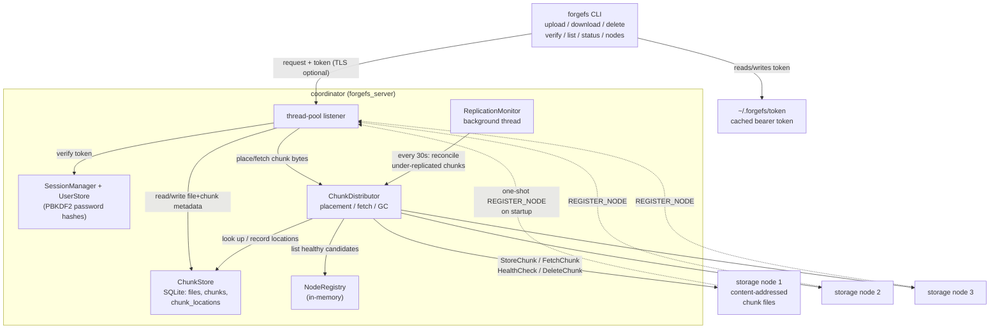

# ForgeFS architecture

## Components

Three binaries, one shared protocol/network/crypto/common codebase:

- **`forgefs_client`** — the CLI. One TCP connection per invocation (each
  command is a separate process run). Caches its session token locally so
  only `login` needs a password.
- **`forgefs_server`** (the coordinator) — never stores a chunk's bytes
  itself. It owns all file/chunk *metadata* (SQLite, via `ChunkStore`),
  decides *where* each chunk lives (`ChunkDistributor`), and tracks which
  storage nodes exist (`NodeRegistry`). A background thread
  (`ReplicationMonitor`) periodically re-replicates chunks that fell below
  the replication factor.
- **`forgefs_storage`** — deliberately dumb. It knows nothing about files,
  users, or other nodes — just "given a chunk id, store/fetch/delete these
  bytes." Content-addressed storage (chunk filename = chunk's own SHA-256)
  means two nodes independently asked to store identical content end up
  byte-identical on disk with no coordination needed.

## Request flows

**Upload.** Client streams the file in 64 KiB pieces over one TCP message
sequence, hashing as it goes (`crypto::Sha256Streamer`). The coordinator
re-buffers those pieces into 4 MiB storage chunks (`UploadSession`); each
time a chunk fills, `ChunkDistributor` picks up to 3 healthy nodes
(round-robin, live-probed) and pushes a copy to each over a fresh
connection, recording every successful placement in `chunk_locations`. Once
all bytes have arrived, the client sends its full-file hash as a trailer;
the coordinator compares it against its own running hash before committing
the file's metadata row — a mismatch aborts the whole upload and releases
whatever chunks were already placed.

**Download.** The coordinator looks up the file's ordered chunk list,
fetches each chunk from whichever replica answers first
(`ChunkDistributor::FetchChunk`, verifying the fetched bytes' hash against
the chunk id before accepting them — content-addressing makes that check
almost free), and re-fragments each 4 MiB chunk back into 64 KiB pieces for
the client stream. The client verifies its own running hash against the
coordinator's trailer before reporting success.

**Node failure and recovery.** A dead node simply stops answering
`HealthCheck`/`FetchChunk` — `ChunkDistributor` treats that as "try the next
replica," so a download in progress fails over transparently as long as one
healthy copy exists. Separately, `ReplicationMonitor` runs on its own
thread and its own SQLite connection, scanning every chunk currently in use
and re-replicating any that have fewer than 3 currently-healthy holders
onto other healthy nodes — so a node that goes down and stays down gets its
chunks rebuilt elsewhere without any client involved.

## Data model

`metadata.db` (SQLite, WAL mode — see [BENCHMARKS.md](BENCHMARKS.md)):

| Table | Purpose |
|---|---|
| `files` | name, size, whole-file sha256, created_at |
| `chunks` | which chunk ids make up a file, in order, with per-chunk size/hash |
| `chunk_locations` | which node id(s) currently hold a given chunk id (many-to-many — this is what makes replication possible) |
| `users` | username + PBKDF2 password hash |

Chunks are content-addressed and reference-counted rather than owned by a
single file: re-uploading a file that happens to produce an identical chunk
doesn't duplicate storage, and deleting a file only releases chunks nothing
else references.

## Concurrency model

Both the coordinator and each storage node serve connections through a
fixed-size thread pool (`common::ThreadPool`) rather than one-at-a-time or
one-thread-per-connection. The only state genuinely shared across those
threads is `ChunkStore` (internally mutex-protected, lock held only around
individual SQLite calls, never across a network round trip) and
`NodeRegistry` (a lock-protected map) — everything else is either
per-connection local state or an independent SQLite connection (the
replication monitor deliberately uses its own, not the request-handling
one).

## Deliberate simplifications (and what production would add)

- **Single coordinator.** There's one coordinator process; it's a single
  point of failure and a scaling ceiling (every metadata operation and
  every chunk placement decision goes through it). A production system
  would run multiple coordinators behind a consensus layer (Raft, or
  delegate metadata to something like etcd) so the coordinator role itself
  has no single point of failure.
- **No cross-coordinator or cross-datacenter awareness.** Replica placement
  is "any 3 healthy nodes," not rack- or zone-aware. A real system would
  bias placement to spread replicas across failure domains.
- **Node protocol is unauthenticated and unencrypted** — a real deployment
  restricts it to a private network or adds mTLS. See
  [SECURITY.md](SECURITY.md) for the full list of what this phase does and
  doesn't cover.
- **No online rebalancing** when a new node joins — it only receives newly
  uploaded chunks, never a share of existing ones. A production system
  would rebalance existing data onto new capacity.
